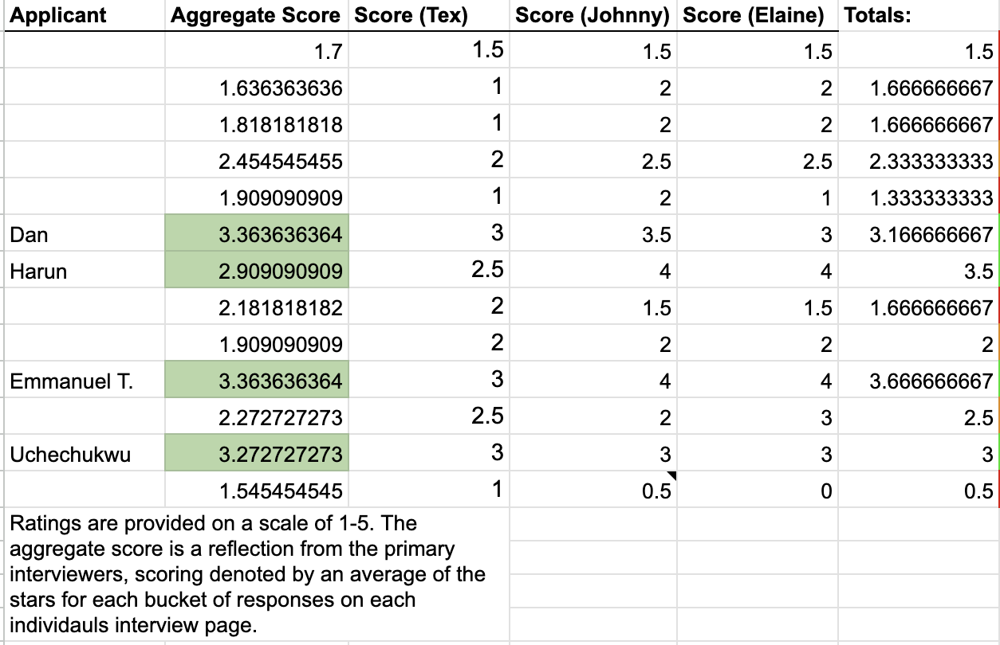

# Developer Advocate Cohort #2

### Cohort #2 Bios:

#### **Dan:** [https://www.linkedin.com/in/danbaruka/](https://www.linkedin.com/in/danbaruka/)

TBD

#### **Emmanuel:**  [https://www.linkedin.com/in/emmanuel-shikuku-devops/](https://www.linkedin.com/in/emmanuel-shikuku-devops/)

Emmanuel Titi is a Developer Advocate at Intersect, dedicated to empowering developers within the Cardano ecosystem. His work focuses on onboarding new contributors, maintaining and improving technical documentation across core repositories, and driving developer evangelism through open collaboration and education.

With a strong background in full-stack and DevOps engineering, Emmanuel has been a key contributor to open-source Cardano projects such as Catalyst Explorer and Govtool Outcomes Pillar. Before joining Intersect, he led development at Lidonation, where he built Cardano-integrated learning and reward platforms, NFT minting tools, and crypto payment packages .

Passionate about open-source development, Emmanuel advocates for a inclusive, and well-documented developer experience helping make Cardano more accessible to builders around the world.

#### Harun:  [https://www.linkedin.com/in/harunslinked/](https://www.linkedin.com/in/harunslinked/)

TBD

#### Uche: [https://www.linkedin.com/in/thisisobate/](https://www.linkedin.com/in/thisisobate/)

TBD

#### Selection Data

Each applicant received a score from 1-10 pre-interview, applicants that received a 5 or higher were scheduled for an interview. Each applicant was asked the same 10-12 Interview questions, carfeul consideration was given relative to the original answers provided in each application. The below screenshot includes the aggregation of ratings from Committee members that gave a rating for each interviewed applicant. Each question asked was scored on a 1-5 scale. All Committee members had access to recordings in a timely fashion as well as the opportunity to provide their own rating.&#x20;

NOTE: Lower scores are indicative of interviews that remained focused on previous activity that did not actively support the revised goals of the Developer Advocate Program. Applicants with higher scores gave the impression of willingness to adjust their focus to achieve the deliverables of the program as well as a refined focus on connecting with individual contributors.&#x20;

<figure><figcaption></figcaption></figure>
