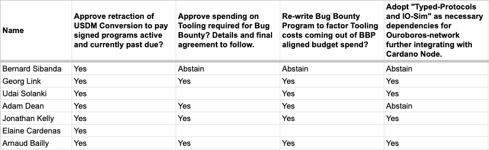

# Interview Reports

Round 1 Interviews: 8 of 15 Applicants selected for various 'Core' and Community Projects.&#x20;



#### Open Source Committee Interview Report Summary

Following a careful review of the 15 applicants in the first round of the Maintainer Retainer Program (MRP), the Open Source Committee (OSC) selected 8 individuals for onboarding. This selection process included separate interviews with project teams (when required) to ensure strong alignment and cohesion. Overall, the committee evaluated an exceptionally strong cohort of candidates, characterized by deep technical expertise within the Cardano ecosystem, and a consistent commitment to collaborative, professional open-source contribution.&#x20;

**Jonathan Rodriguez** - [https://github.com/solidsnakedev](https://github.com/solidsnakedev) - EvolutionSDK\
Jonathan is a strong and experienced candidate, recognized for his deep technical expertise in smart contracts and for creating and leading maintenance of the Evolution SDK and Lucid Evolution.

* Technical Leadership: Proven leader, core maintainer, and skilled in building complex open-source tools from scratch.
* Quality & Problem Solving: Experience successfully navigating complex transitions (e.g., the Conway transition) and has a strong emphasis on testing, noted as a "highlight" of his experience.

**Kevin Hammond** - [https://github.com/kevinhammond](https://github.com/kevinhammond) - Cardano Node\
Kevin is an exceptionally talented candidate with potentially the highest technical knowledge of Cardano core repositories among all applicants. Kevin is recognized for his leadership in Haskell Node release management processes and it is important, in the eyes of OSC, to retain his skilled and attentive approach within the process.

* High Technical Expertise: Recognized for a deep understanding of Cardano core repos.
* Collaborative Strength: He maintains good relationships with other developers and has the ability to provide constructive, encouraging feedback.

**André Diamond** - [https://github.com/Andre-Diamond](https://github.com/Andre-Diamond) - Mesh Multisig\
André is a well-aligned candidate for the Mesh Multisig project. He has been active in the Cardano ecosystem since 2020 and is an existing contributor to the MeshJS Multisig repository.

* Proven Track Record: Active contributor who built features like a cron job for calculating Total Value Locked (TVL).
* Technical & Professional: Highly proficient in TypeScript and demonstrates a professional, collaborative mindset, prioritizing project goals over personal preferences.
* Focus: Highly specific in his interest in the Mesh Multisig repository, reflecting an intentional contribution path.

**Quirin Schlegel** - [https://github.com/QSchlegel](https://github.com/QSchlegel) - Mesh Multisig\
Quirin is a strong candidate with a proven track record of technical leadership and deep roots in the Cardano ecosystem since 2017.

* Proven Leadership & Readiness: Already serves as the core maintainer for the MeshJS multisig project, demonstrating immediate readiness.
* Technical Proficiency: Praised for expert problem-solving skills, including complex serialization issues and practical workarounds for CIP implementations.
* Collaborative Mindset: Effective working with other maintainers and proactive in resolving technical bottlenecks.

**Darlington Kofa** - [https://github.com/profd2004](https://github.com/profd2004) - Cardano DB-Sync\
Darlington is recognized as a highly experienced and culturally aligned candidate for the maintainer program. He is a seasoned software engineer with 20 years of experience.

* Technical Depth: Expert-level TypeScript proficiency and intermediate Rust competency, making him a strong fit for the Multisig-Mesh project, though his Haskell skills are at a beginner level.
* Conflict & Community Leadership: Highly effective at diffusing conflicts using data/analytics and coaching team members. He is a strong advocate for mentorship and "open lines of communication".

**Suganya Raju** - [https://github.com/SuganyaAK](https://github.com/SuganyaAK) - Cardano API/CLI\
Suganya Raju is viewed as a highly collaborative and promising candidate with a solid foundational background. She is a technically capable developer with strong TypeScript proficiency.

* Proactive Contribution: Already active in the ecosystem by drafting improved documentation for the Cardano CLI.
* Collaborative Mindset: Impressed evaluators with her supportive, respectful peer-review style and commitment to open communication.
* Growth Potential: While Haskell and Plutus skills are in development, she is seen as a valuable contributor with a clear motivation to grow.

**Joris Dral** - [https://github.com/jorisdral](https://github.com/jorisdral) - LSM Tree\
Joris Dral is a high-caliber candidate with elite technical expertise and a deep connection to the Cardano ecosystem. He is a professional Haskell consultant and the original creator of the LSM Tree repository.

* Technical Authority & Continuity: Recognized as a Haskell and Rust expert. His status as the repository creator ensures absolute familiarity with the codebase and concepts.
* Maintainability & Collaboration: Praised for his systematic analysis of complex system behaviors, reliance on incremental testing, and commitment to project maintainability through thoughtful code reviews.

**Leonard Hegarty** - [https://github.com/hegaleon](https://github.com/hegaleon) - Cardano Node Emulator\
Leonard Hegarty is highly seasoned and a strategically valuable candidate. He is a senior-level contributor with over 20 years of technical and leadership experience.

* Deep Experience: 20+ years of C++ development and significant experience leading worldwide remote teams.
* Ecosystem & Architecture: Highly rated for his deep architectural understanding of Cardano’s critical repositories and mature grasp of open-source building blocks.
* Project Fit: Well-suited for the Cardano Wallet or Node Emulator projects.

**Conclusion:**\
The first MRP cohort features a mix of core repository creators, established leaders, and highly talented specialists, all demonstrating a commitment to the Cardano ecosystem.&#x20;

**Appendix:** The following images indicate scoring completed by OSC Members at the Application stage for the first round. The separation of graphics is related to the change in the Committee body at the most recent election, occurring amidst applications for MRP being open.&#x20;

.png>)

 
