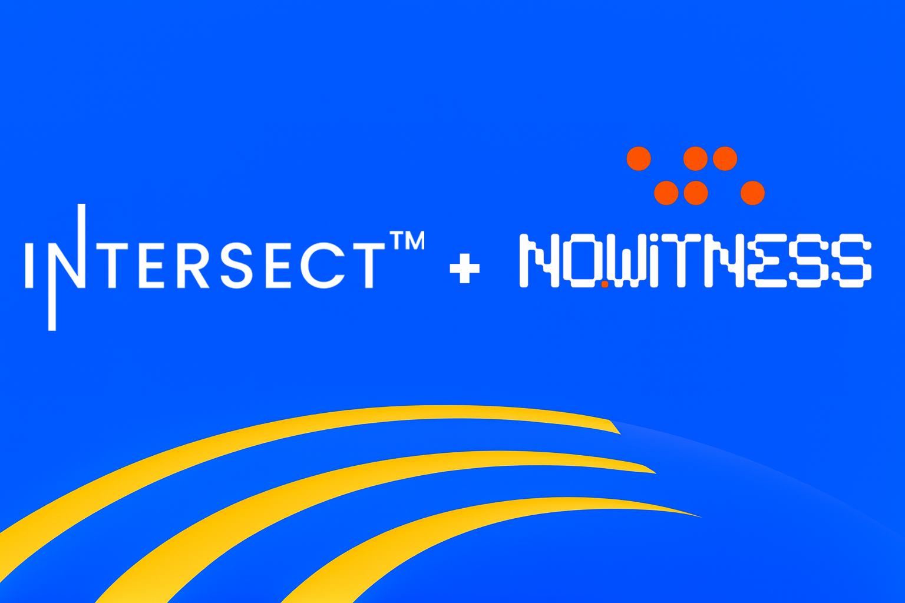

# 🙃 (11/20/2025) Meeting Minutes

## Attendees: 

| Name                     | Attendance | Role      | Voting Seat (Y/N) | Term         |
| ------------------------ | ---------- | --------- | ----------------- | ------------ |
| Elaine Cardenas          | Yes        | Chair     | Y                 | April 2026   |
| Terence ‘Tex’ McCutcheon | Yes        | Secretary | N                 | N/A          |
| Christian Taylor         | Yes        | SME       | N                 | N/A          |
| P. Lucas                 | Yes        | Member    | Y                 | October 2025 |
| Adam Dean                | Yes        | Member    | Y                 | October 2025 |
| Arnaud Bailly            | Yes        | Member    | Y                 | April 2026   |
| Georg Link               | Yes        | Member    | Y                 | April 2026   |
| Jonathan Kelly           | Yes        | Member    | Y                 | October 2025 |
| Sebastian Pabon          | Yes        | Member    | Y                 | October 2026 |
| Philip DiSarro           | No         | Member    | Y                 | April 2026   |
| Bernard Sibanda          | Yes        | Member    | Y                 | October 2026 |
| Jordan Hill              | Yes        | Member    | Y                 | October 2026 |
| Reshma Mohan             | Yes        | Member    | Y                 | October 2026 |
| Udai Solanki             | Yes        | Member    | Y                 | October 2026 |
| Empty Seat               | No         | Member    | Y                 | April 2026   |

Community/Other Attendees

* Andrew Aitken
* Dan Baruka
* Emmanuel Titi
* Marcin Szamotulski
* Uche Obasi

**Recording:** [Open Source Committee (Intersect) - 2025/11/20 - Recording](https://drive.google.com/file/d/19tQcEAPnVonVBYkiq8_3XAIGasosmYnT/view?usp=sharing)

**Transcript:** [Open Source Committee (Intersect) - 2025/11/20 - Transcript](https://docs.google.com/document/d/1sfq0LLvpx4j_yBzWNgCWuaIvrO5uDT007na7cdaRW70/edit?usp=sharing)

**Chat Transcript:** [Open Source Committee Meeting – 2025/11/20 – Chat Transcript](https://drive.google.com/file/d/1QxqXYIkeGnVhLtq69dGD28Kw6Tdju0MC/view?usp=sharing) 

## Intros

**Christian:** Head of Open Source Office, Intersect, OS SME\
**Tex:** Open Source Program Manager, Intersect Staff, Open Source Committee Secretary\
**Arnaud:** OSC Member, CF\
**Bernard:** OSC, TSC Intersect, CIP Editors, DripDropz, LLC\
**Elaine:** newly elected OSC, Aira corporation CTO\
Georg: Bitergia\
**Jordan:** TBD\
**Reshma:** TBD\
**Sebastian:** OSC, Gimbalabs, contributor, Andamio co-founder.\
**Philip:** TBD \
**Udai:** TBD

## Agenda 11.20.25

* Meet and Greet/Welcome to New Members
* Thanks to previous Members
* Developer Advocate Update
* Confirm decision to return to ADA Spend
* Marcin - Repo Transfer
* MRP Interviews scheduled
* GitHoney Decision
* Open Forum

## Decisions/Actions

Decisions

* The committee unanimously voted to forgo the USDM conversion process for immediate program payments due to administrative delays and proceed with payments in ADA.
* The committee approved that program recipients (e.g., Developer Advocates, Bug Bounty) be given the option to accept the ADA payment immediately or wait to see if a USDM conversion can be facilitated later.
* The committee approved the $22,000 funding for the GitHoney tooling to implement the private disclosure feature for the bug bounty program.
* The committee voted to rewrite the Bug Bounty program budget to factor in the approved tooling costs for GitHoney.
* The committee approved the transfer of ownership of the core repositories (ant-protocols and IOM) from IOG/IOHK to Intersect.

Actions

* **Christian** or **Terence** will take over leading the rest of the meeting after Elaine departs.
* **Christian** will update the necessary forms to reflect a repository transfer process (not Project Incubation) for the IOG/IOHK repositories.
* **Terence** will take the decision back to the Open Source Office team to rewrite the bug bounty program budget to include the GitHoney tooling costs.
* **Jonathan** will conduct interviews for the Maintainer Retainer Program (his final act for the committee).
* **Terence** will ensure the Maintainer Retainer interviews are recorded and placed in a confidential folder in the Drive.
* **Terence** will update the Gitbook page to properly identify the new committee members.
* **Christian** will set up one-on-one catch-up meetings with Jordan and Reshma to bring them up to speed.
* **Marcin** will be provided with the appropriate form to submit the repository transfer request properly.

**Polls**

| Topic                                  | Discussion                                                                                                                                                                                                                                                                                                                                     | Notes                                                                                                                                                                                         |
| -------------------------------------- | ---------------------------------------------------------------------------------------------------------------------------------------------------------------------------------------------------------------------------------------------------------------------------------------------------------------------------------------------- | --------------------------------------------------------------------------------------------------------------------------------------------------------------------------------------------- |
| Onboarding Deck/Process                | Christian asked if a deck was prepared for onboarding. Terence suggested using the existing Gitbook as it would be the most effective resource.                                                                                                                                                                                                | Agreed to use the Gitbook for new member onboarding.                                                                                                                                          |
| Meeting Agenda                         | Christian outlined the proposed agenda: Intros/Meet and Greet, ADA Decision, Merchant (GitHoney), and then four, five, six (other topics).                                                                                                                                                                                                     | Agenda set: Intros → ADA → GitHoney → Other.                                                                                                                                                  |
| Introductions (Meet & Greet)           | Terence kicked off intros, passing to Elaine. Elaine welcomed new members, gave a brief intro, and noted she might have to drop early. Outgoing members (Lucas, Jonathan) offered farewells and insights. New/Re-elected members (Udai, Reshma, Georg) introduced themselves.                                                                  | New and outgoing members of the OSC and TSC were introduced briefly.                                                                                                                          |
| Developer Advocate Update              | Uche provided an update, focusing on recent community events: Nairobi success (onboarding developers), a contributor virtual workshop (30+ attendees), and a planned physical event in Nigeria.                                                                                                                                                | Community events are a major focus for the Developer Advocates team.                                                                                                                          |
| GitHoney/ADA Decision Timing           | Elaine noted she might have to leave earlier than expected and proposed moving to the GitHoney decision first.                                                                                                                                                                                                                                 | Priority changed to address GitHoney/ADA funding issues immediately.                                                                                                                          |
| ADA Spend Decision (Forgoing USDM)     | Terence explained that administrative delays (lack of signatures due to travel/sickness) prevented the ADA to USDM conversion, risking late payment of active contracts. The Open Source Office (OSO) provisionally agreed to use ADA to pay programs already approved. The committee was asked to formally forgo the USDM conversion for now. | Voted unanimously (8 of 9 members) in favor of paying in ADA immediately to prevent further delays, with the understanding that this might necessitate using ADA for future programs as well. |
| GitHoney Funding Proposal              | Christian presented GitHoney's response regarding the bug bounty program: 1.5 FTEs over two months for building the private disclosure mechanism and platform adaptation. The decision needed was: 1) Does the committee need more information? 2) How to fund the $22,000 cost (half of the total $44k build cost).                           | Jonathan clarified that the $22k is for building the private disclosure API integration for the bug bounty program.                                                                           |
| GitHoney Funding Source                | Discussed funding the $22,000 cost. Options included using canceled program funds (Google Summer of Code) or recategorizing it under existing programs like Bug Bounty or Tooling/Sustainability.                                                                                                                                              | Voted unanimously to approve funding for the GitHoney tooling and to rewrite the Bug Bounty program budget to factor in this setup cost.                                                      |
| Repository Transfer (IOG to Intersect) | Marcin requested transferring core dependencies (e.g., IO-HK/ouroboros-network, Cardano-Haskell/cardano-node) from IOG to Intersect due to maintenance issues now that key contributors (Marcin, Duncan) are outside IOG. The proposal was framed as a maintenance transfer, not a full incubation.                                            | Voted in favor of the transfer (Yes/Abstain majority), with Terence asking Marcin to resubmit via the repo transfer form (not project incubation) for proper process.                         |
| Outgoing Member Appreciation           | Terence thanked outgoing members (Adam, Jonathan, Lucas, others) for their service and welcomed them to return as advisors.                                                                                                                                                                                                                    | Acknowledgment and thanks given to members whose terms are ending.                                                                                                                            |
| Maintainer Retainer Program            | Jonathan announced his "final act" will be conducting the first five interviews for the Maintainer Retainer program, which will be recorded and shared with the committee.                                                                                                                                                                     | Interviews for the Maintainer Retainer Program are underway.                                                                                                                                  |
| Developer Advocate Follow-up           | Jonathan provided an additional note on the Developer Advocate work: a new community hub is being set up in Zambia following a conference speech.                                                                                                                                                                                              | New community hub initiative launched in Zambia.                                                                                                                                              |
| New Member Onboarding                  | Terence conducted an informal onboarding session using the Gitbook for new members, covering the Charter, Budget (PDF), Communications (Discord, X, YouTube), and Program information (Paid Open Source Model, Working Groups).                                                                                                                | New members encouraged to review the Gitbook and YouTube channel for comprehensive information.                                                                                               |
| Next Steps                             | Christian offered one-on-one catch-up calls to new members (Jordan, Reshma) for more detailed context.                                                                                                                                                                                                                                         | Christian will schedule follow-up calls with new members.                                                                                                                                     |
